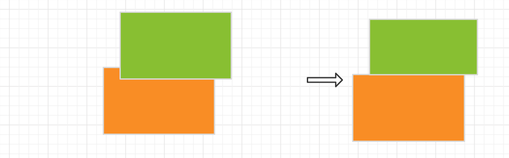

# 算法参数
 - 子元素集合占用父元素最大宽度or高度占比 
 - 重叠max 
 - 重叠min
 - 重叠部分宽/高比差

# 实现路径
- 处理重叠情况
- 确定父子关系
- 确定主轴方向

## 如何处理部分重叠的情况
页面元素不仅仅有并列和包含的关系，肯定是有重叠的情况，但是重叠的情况单纯依靠flex布局无法实现，而且在组件布局中，重叠的概率相对较低，所以我们把重叠的定义留给拖拽部分。在转换环境为了降低对整体布局的影响，对重叠元素做如下处理：
只考虑两个元素的重叠，两元素以上的重叠暂不考虑。
在只考虑矩形的情况下，分为单角重叠、两角重叠和全部重叠（三角和四角)、无角重叠。
- 单角重叠的情况下，这种情况下，根据前端经验，一般都是将较大元素作为主元素，小元素为角标，
    - 可以区分大小，只保留大的元素
        
    - 不可以区分大小
        - 重叠面积大于50%， 按上一个元素
        
        - 重叠面面积小于50%,删除元素重叠部分
        
- 两角重叠的情况

    -  如果重叠面积大于两者之一的70% 则将小的忽略，按一个元素处理，直接用大的代替整体
        
    - 如果重叠部分，两者大于20%小于70%，
        - 两元素重叠部分宽/高相差不大10%，将两个元素进行合并按同一元素处理
            
        - 两元素重叠部分宽/高相差较大，做如下处理
            
    - 如重叠部分两者之一的小于20%,则按两个元素处理，重叠部分忽略  
        
- 无角重叠的情况  
    - 比较节点无子元素
    
    - 比较节点有子元素
        - 两元素重叠比大于比较节点50%
        
        - 量元素重叠比小于比较节点50%
        

## 确认父子关系
将一维数组从头到尾进行遍历，新加入的元素和之前已入队的元素作比对：
 - 做比对的顺序应该是从顶开始，直到找到其所在的位置
 - 如果重叠的话，先做重叠处理，再进入下一步
 - 插入元素分位置两种分类 （并列 和包含）
    - 位置包含
            - 宽度 or  长度 如果大于当前父元素的90% 则直接作为子元素
            - 宽度/长度 小于当前父元素的50% 直接当做孙元素，外测包裹父元素
    
    - 并列  
    包含中一定是并列的，所以包含解决了父子关系，而并列解决的是兄弟的关系。包含解决结构，并列解决样式
        - 当元素通过验证（个数和位置）被放入父元素后，需要和父元素的所有子元素做比对，用来完成样式的确定
            - 确定主轴方向: flex-direction
            - 确定相对主轴方向的排布： justify-content
            - 确定相对交叉轴的排布：align-items
            - 是否有折行： flex-wrap
            - 折行后多轴线的对齐方式： align-content

## 确定主轴方向
确定主轴方向，
- 至少需要两个元素
- 一次元素添加可以会涉及到多个主轴的确定。   
   > eg: 孙元素的添加，确定了父元素的主轴。父元素确认后，父元素兄弟间的关系也会确认（修改）。  
- 位置关系分类
    - 同一行（column_min 和 column_max吻合）则是行布局
    - 同一列（比较row_min 和 row_max）则是列布局
    - 
需要处理一些特殊情况。父元素可能在多次添加后有多个选项。比如以下布局，可以考虑变为行布局，也可变为列布局
 - - - - - 
 - - - - - 

这种情况就和元素的进入顺序有很大关联。