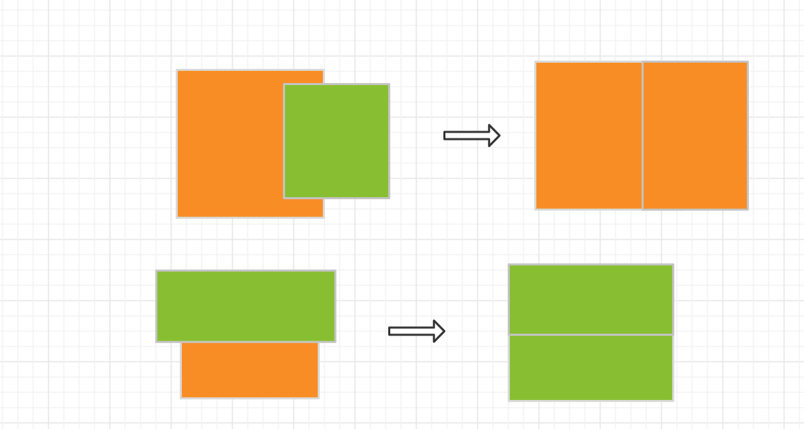

# 算法参数
 - 父元素最多子元素数量
 - 子元素集合占用父元素最大宽度和高度占比 
 - 重叠max 
 - 重叠min
 - 重叠部分宽/高比差

# 实现路径
- 处理重叠情况
- 确定父子关系
- 确定主轴方向

## 如何处理部分重叠的情况
页面元素不仅仅有并列和包含的关系，肯定是有重叠的情况，但是重叠的情况单纯依靠flex布局无法实现，而且在组件布局中，重叠的概率相对较低，所以我们把重叠的定义留给拖拽部分。在转换环境为了降低对整体布局的影响，对重叠元素做如下处理：
-  如果重叠面积大于两者之一的70% 则将小的忽略，按一个元素处理，直接用大的代替整体
    
- 如果重叠，两者大于20%小于70%，
 - 两元素重叠部分宽/高相差不大10%，将两个元素进行合并按同一元素处理
    
 - 量元素重叠部分宽/高相差较大，做如下处理
    
- 如果两者的大小差距小于20%,则按两个元素处理，重叠部分忽略
    

## 确认父子关系
将一维数组从头到尾进行遍历，新加入的元素和之前已入队的元素作比对：
 - 做比对的顺序应该是从顶开始，直到找到其所在的位置
 - 如果重叠的话，先做重叠处理，再进入下一步
 - 插入元素分两种分类 （并列 和包含）
  - 宽度 or  长度 如果大于当前父元素的90% 则直接作为子元素
  - 宽度/长度 小于当前父元素的50% 直接当做孙元素，外测包裹父元素
- 暂先不考虑部分重叠的部分，部分重叠需要依赖相对定位的能力

## 确定主轴方向
确定主轴方向，至少需要两个元素，一次元素添加可以会涉及到多个主轴的确定。
    eg: 孙元素的添加，确定了父元素的主轴。父元素确认后，父元素兄弟间的关系也会确认。
    需要处理一些特殊情况。父元素可能在多次添加后有多个选项。
